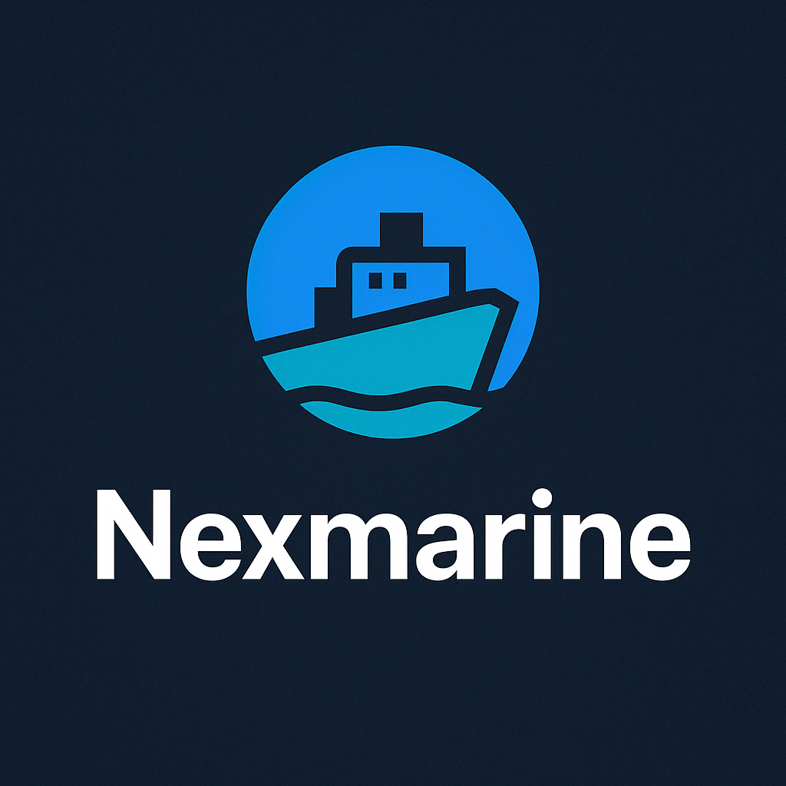
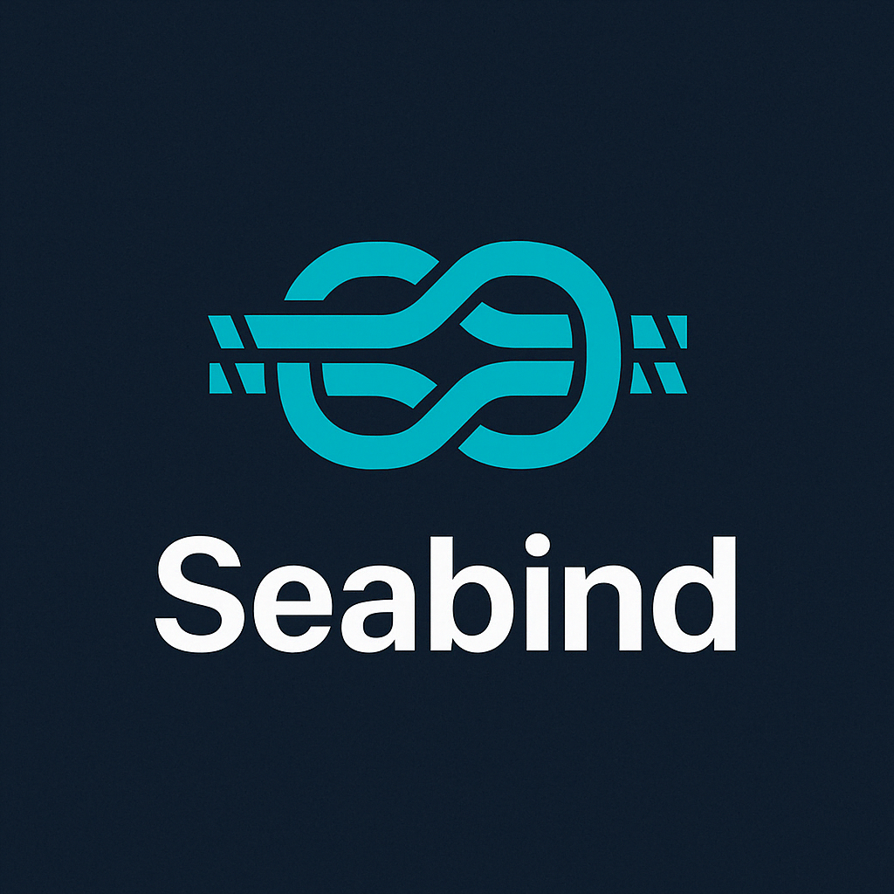

# Nexmarine



**Nexmarine** is a blazing-fast, cross-platform marine data server written in Rust. Designed as a modern alternative to bulky middleware solutions, Nexmarine leverages the lightweight and efficient **Seabind** protocol to handle vessel data with precision, reliability, and speed.

---

## 🚀 Features

- ⚡ **Rust-Powered Performance** — Safe, concurrent, and memory-efficient
- 🌊 **Seabind Protocol** — Custom, lightweight, and extensible marine data protocol
- 📡 **Real-Time Data Streaming** — WebSocket & REST API support
- 🌐 **Cross-Platform** — Runs on Linux, macOS, Windows, Raspberry Pi, and embedded systems
- 🔌 **Modular & Extensible** — Plugin-ready architecture without the bloat
- ⚙️ **Supports NMEA 0183/2000**, GPS, AIS, environmental sensors, and more
- 📝 **Simple Configuration** — Human-readable TOML config files
- 📊 **Dashboard Ready** — API endpoints for easy integration with web/mobile UIs

---

## 🌐 Seabind Protocol



**Seabind** is a next-generation protocol crafted for efficient marine data communication.

### Key Highlights:
- 🔹 **Binary + JSON Hybrid** — Optimized for both machine efficiency and human readability
- 🔹 **Structured Data Paths** — Example: `nav.position.latitude`
- 🔹 **Unit-Aware** — Integrated support for maritime units (knots, meters, degrees)
- 🔹 **Low Overhead** — Minimal packet size, ideal for embedded and IoT devices
- 🔹 **Versioned Schema** — Future-proof design with backward compatibility
- 🔹 **Secure by Design** — Supports encrypted channels (TLS/WebSocket Secure)

📄 **Protocol Spec:** [docs/seabind.md](https://github.com/makalin/Nexmarine/tree/main/docs/seabind.md) *(Coming Soon)*

---

## ⚡ Quick Start

### 1. Install via Cargo
```bash
cargo install nexmarine
```

### 2. Example Configuration (`nexmarine.toml`)
```toml
[input]
source = "/dev/ttyUSB0"
format = "nmea0183"

[output]
websocket = true
rest_api = true
seabind_log = "./logs/vessel_data.sbnd"
```

### 3. Run Nexmarine
```bash
nexmarine --config nexmarine.toml
```

Access API: `http://localhost:8000/api/status`  
WebSocket: `ws://localhost:8000/ws`

---

## 📅 Roadmap

- [ ] Seabind Protocol v1.0 Release
- [ ] Live Web Dashboard (WASM-based)
- [ ] MQTT & CAN Bus Integration
- [ ] Cloud Sync Options
- [ ] Mobile App SDK
- [ ] Auto-discovery for onboard devices
- [ ] Nexmarine + Signal K Bridge

---

## 🤝 Contributing

Contributions, issues, and feature requests are welcome!  
Feel free to check the [issues page](https://github.com/makalin/Nexmarine/issues).

1. Fork the project
2. Create your feature branch (`git checkout -b feature/AmazingFeature`)
3. Commit your changes
4. Push to the branch
5. Open a Pull Request

---

## 📄 License

This project is licensed under the MIT License — see the [LICENSE](LICENSE) file for details.

---

## 👨‍💻 Author

**Mehmet Turgay AKALIN**  
🔗 [github.com/makalin](https://github.com/makalin)  
🚀 Passionate about Rust, marine tech, and open-source innovation.
